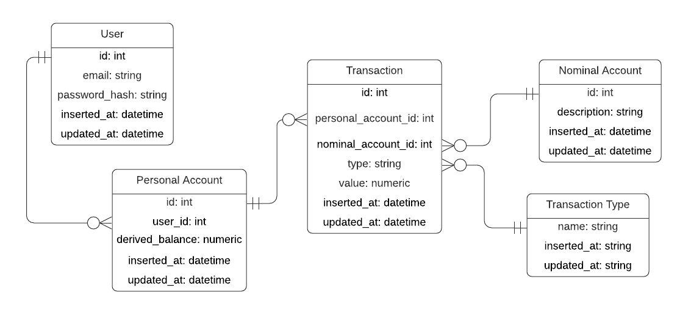

# Contributing

When contributing to this project, first read the [Design Decisions](#design-decisions) that were made to get here, and what's the vision on how to extend and when. Before making a pull request, it's recommended to open an issue to discuss the changes.

## Table of Contents

<!--ts-->
  * [Contributing](#contributing)
  * [Table of Contents](#table-of-contents)
  * [Pull Request Process](#pull-request-process)
  * [Design Decisions](#design-decisions)
    * [Why Double Entry Bookkeeping](#why-double-entry-bookkeeping)
    * [Database Model](#database-model)
    * [Why is user information separated from Personal Account?](#why-is-user-information-separated-from-personal-account)
    * [Transaction value as string](#transaction-value-as-string)
  * [Trade-offs](#trade-offs)
    * [Why does transfers go through an Asset Nominal Account, instead of a Liability?](why-does-transfers-go-through-an-asset-nominal-account-instead-of-a-liability)
    * [string vs int vs float to represent a transaction value](#string-vs-int-vs-float-to-represent-a-transaction-value)
    * [Nominal Account and Personal Account](#nominal-account-and-personal-account)
    * [No balance column](#no-balance-column)
  * [Road to the Future](#road-to-the-future)
    * [Improve balance calculation](#improve-balance-calculation)
    * [Add new Personal Account Types](#add-new-personal-account-types)
    * [Add new Nominal Account Types](#add-new-nominal-account-types)
    * [Adding a fee for certain Personal Accounts](#adding-a-fee-for-certain-personal-accounts)
  * [Conclusion](#conclusion)
<!--te--> 
## Pull Request Process

1. Ensure that any new dependency is added to mix.exs, and the compilation works from a clean pull from the branch
2. Update the README.md if necessary, and the [Design Decisions](#design-decisions) section
3. Ensure that the [Database Model](#database-model) is up to date
4. Ensure you have tests covering the core parts of the pull request
5. Open the PR and ask for a review from any maintainer. The sign-off from one maintainer is already enough to merge the PR.

## Design Decisions

Here you'll find all design decisions that were made to arrive at the current architecture, for technical design decisions, you'll find them as in-code documentation.

### Why Double Entry Bookkeeping?

Although this project aims to be a simple bank accounting system, developing a homegrown system that only works for the proposed features are prone to errors and maintainability issues, as we would reinvent the wheel in most cases.
That's why we're adopting the Double Entry Bookkeeping approach, that's tried and true in the accounting industry.

Double Entry Bookkeeping can be used as a financial tracking system, but not all financial tracking systems can be used as a Double Entry Bookkeeping system.
So to improve maintainability, we're adopting it, and simplifying what we'll implement from it, but still paving the road to a full-blown Double Entry Bookkeeping system if necessary.

### Database Model



To properly understand the trade-offs being made here, and the path to the future, please read the wiki entry on [Double Entry Bookkeeping](https://github.com/gugahoa/bank_accounting/wiki/Double-Entry-Bookkeeping). If you already know about Double Entry Bookkeeping, keep in mind that we adopt the Traditional Approach to reason about debit and credit.

The Nominal Account id has semantic meaning, and should not be random, so it can be relied upon as a static value thorough the code base.

This model is enough to properly represent transactions between accounts, deposits to an account and consulting account balance.
As the system requirements evolve, you may need to extend this. We'll discuss in [Road to the Future](#road-to-the-future) what requirements would elicit what changes.

### Why is user information separated from Personal Account?

User information could very well live in the Personal Account table.
I thought of two cases where I wouldn't put User information inside Personal Account:

- There's a separate process from User signup to Personal Account creation. For example, an approval process.
- A User can have more than one Personal Account.

Since both of these cases seems common enough, I modeled as such.

## Trade-offs

### Why do transfers go through an Asset Nominal Account, instead of a Liability?

If you read the [Transfer between accounts](https://github.com/gugahoa/bank_accounting/wiki/Double-Entry-Bookkeeping#transfer-between-checking-accounts) in the Double Entry Bookkeeping wiki page, you may have wondered why did we choose to move money through an asset account instead of a liability account.

To keep the [Database Model](#database-model) relatively simple, two assumptions are being made about the types of Personal Account and Nominal Account.
The model and project are assuming that all Personal Accounts are liabilities, and all Nominal Account are assets.

If we [add a new Personal Account Type](#adding-a-new-personal-account-type) and [add a new Nominal Account Type](#adding-a-new-nominal-account-type), it would be possible to make the transfer between accounts go through a liability Nominal Account instead of an asset one.


### string vs int vs float to represent a transaction value

The criteria to choose which representation to use for transaction value were:

- Easy to do arithmetic operations
- Has a straightforward way to handle precision
- Won't require many changes to the backend if precision is later increased

All three types satisfy the first criteria if we handle string with the Decimal library.

Only int and string have a straightforward way to handle precision.

The representation that requires the least change to the backend if we increase the precision is string, requiring only a change to the Decimal library context.

### Nominal Account and Personal Account

Having an Accounts table instead of two separate tables, with a type column, would simplify the transactions between Personal Accounts, however, it would likely lead to a rewrite down the road. There are two main reasons why they were separated:

The first reason for separating them is to use the same vocabulary from the domain, inside the software. This will make software engineers and the rest of the company share the same vocabulary.

The second reason is that in the future, Personal Account and Nominal Account could be quite different. With Nominal Account having more internal information, and Personal Account having more information about fees and customer information.
We talk about personal account fees, other kinds of personal account and revenue in the [Road to the Future](#road-to-the-future) section.

### No balance column

A balance column can lead to inconsistencies, as it's a fact that is derived from the transactions table. Adding it would mean that we have to program a routine to keep it in sync with the source of truth (Transactions table).
A better approach, discussed in [Road to the Future](#road-to-the-future) is to create a Personal Account Closed Balance table (same applies for Nominal Accounts) and only update it on every defined time window that makes sense.
Then the number of rows needed to calculate the balance would be 1 + all transactions from that account on the open period.

## Road to the Future

### Improve balance calculation

With the current model, to calculate the balance of an account, you have to sum all the transactions ever from that account.
That's a clear target for optimization in the future.
To improve that, we could create two new tables: Personal Account Closed Balance and Nominal Account Closed Balance.

Those tables would only have a foreign key to the account, a balance column and optionally other information that may be relevant (such as total credit, or total debit).

### Add new Personal Account Types

Currently the system considers all Personal Account to be a Checking Account.
When it's time to add new Personal Account Types, we could create a Personal Account Type table, and add a new column to Personal Account that references a Personal Account Type row.

If it comes to this, make sure to also be explicit about what's the [normal balance](https://en.wikipedia.org/wiki/Normal_balance) for that type of account.

### Add new Nominal Account Types

The approach here is the same as [adding a new Personal Account Type](#add-new-personal-account-types), but for Nominal Accounts.

### Adding a fee for certain Personal Accounts

Adding a fee could either be a column of Personal Accounts Type (refer to [Add new Personal Account Types](#add-new-personal-account-types)), or a new table and be related to the Personal Account itself.

This is highly dependent on context, so take some time to properly reason about where it would make more sense to add the fee attribute.

Then to add a fee as revenue, you have to [add new Nominal Account Types](#add-new-nominal-account-types), and create a Nominal Account of type Income.

A transaction that generates a fee could look like this:
```
Debit - Client A Checking - $1
Credit - Bank Fee Revenue - $1
```

### Adding new kinds of transactions

Currently all transactions are either deposits or withdrawals, and we reason about them seeing if the transaction is a debit or credit. Credit on a Personal Account is a deposit and debit on a Personal Account is a withdrawal.

To add different kinds of transactions, create an Extended Transaction Type table, which would have the different types of transactions that are being added, and add a column to Transactions that reference Extended Transaction Type table.

## Conclusion

Now you should have all the context necessary to reason about new features, and a clear view of how to further extend what we already have.

If you feel that something is missing, please feel free to open an issue so we can further improve this guide.

